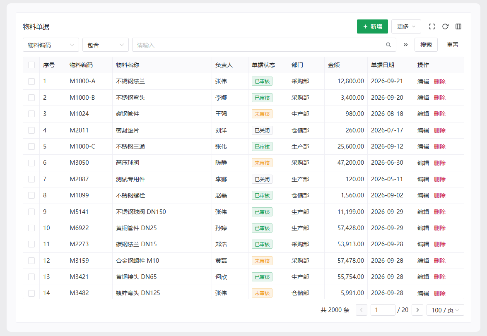
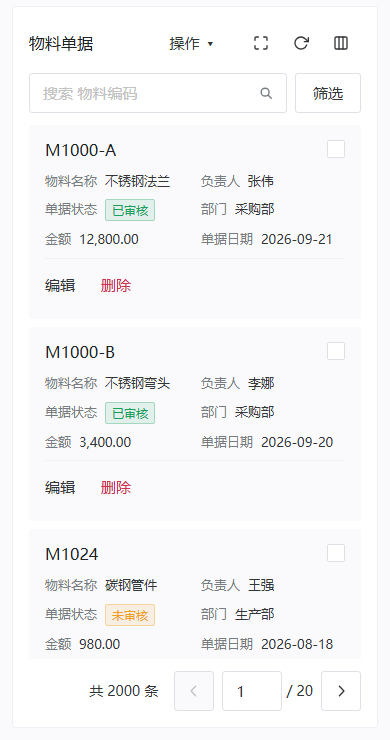
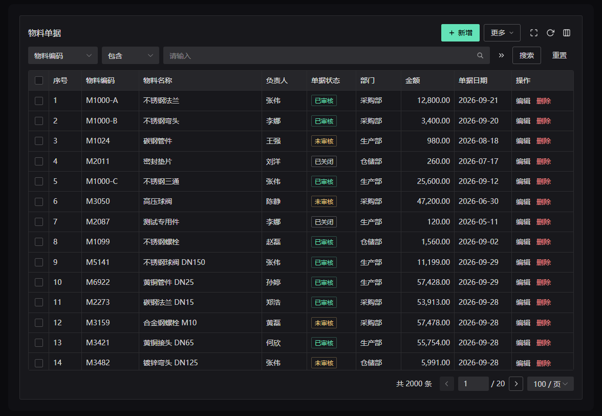
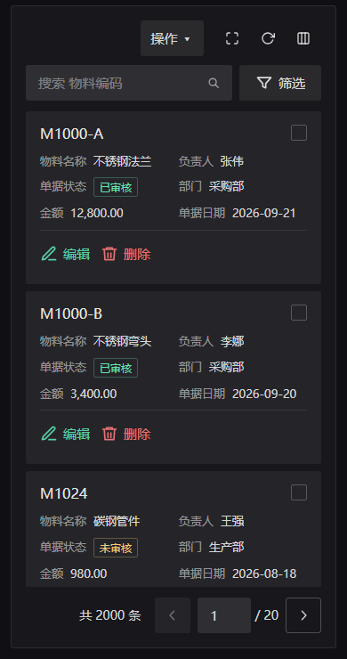
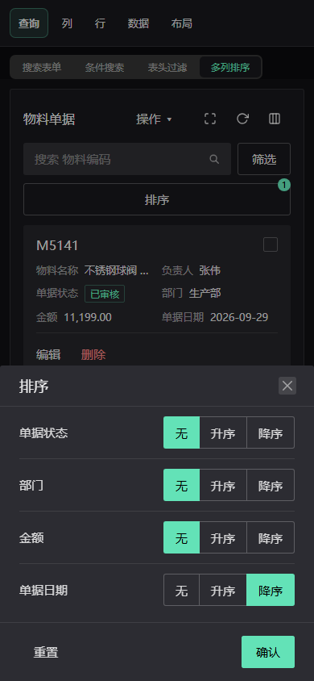
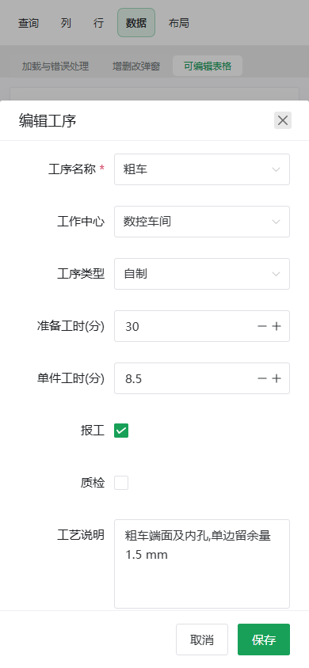
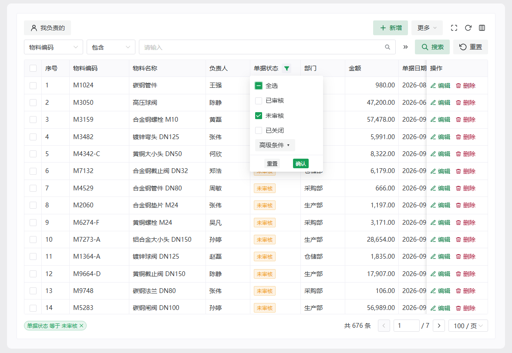
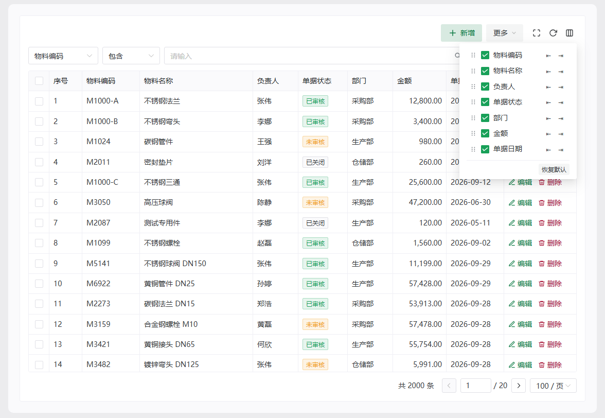
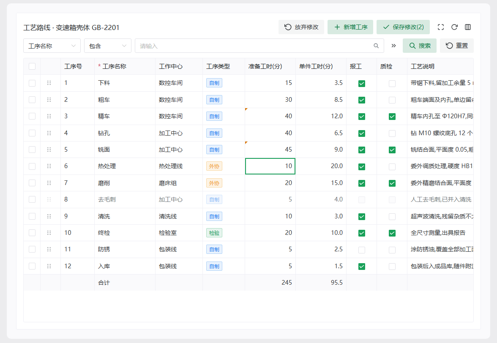
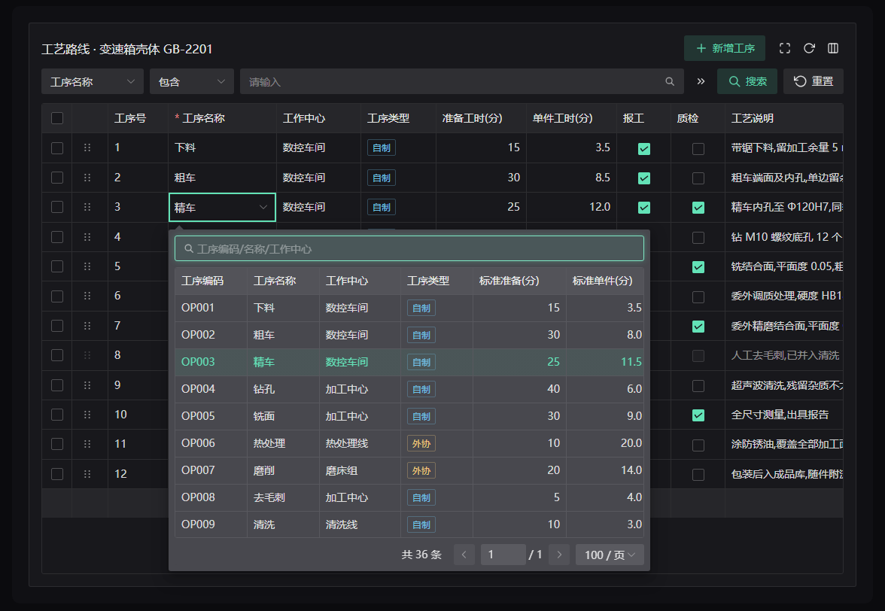

<div align="center">

# smart-naive-table

**Write `columns`. Get a complete admin list page — a table on desktop, cards on phones.**<br>
Search, filters, sorting, pagination, dict tags, column settings and editing all grow out of your column config.

[](https://www.npmjs.com/package/smart-naive-table)
[](./LICENSE)


[简体中文](./README.md) | English

</div>

<table>
  <tr>
    <td>
      <picture>
        <source media="(prefers-color-scheme: dark)" srcset="./assets/preview-wide-dark.png">
        
      </picture>
    </td>
    <td>
      <picture>
        <source media="(prefers-color-scheme: dark)" srcset="./assets/preview-narrow-dark.png">
        
      </picture>
    </td>
  </tr>
  <tr>
    <td align="center">Wide tier: a table</td>
    <td align="center">Narrow tier (390px): the same config becomes cards</td>
  </tr>
</table>

<p align="center">
  <a href="#highlights">Highlights</a> ·
  <a href="#feature-list">Features</a> ·
  <a href="#screenshots">Screenshots</a> ·
  <a href="#mobile-responsive">Mobile</a> ·
  <a href="#quick-start">Quick start</a> ·
  <a href="#recipes">Recipes</a> ·
  <a href="#api-reference">API</a> ·
  <a href="#milestones">Milestones</a> ·
  <a href="#documentation">Docs</a>
</p>

> **Version status**: the current version is `3.1.3` (npm `latest`). 3.0 is a major upgrade: some behavior changes even if you change no code. See [MIGRATION.md](./MIGRATION.md) for the upgrade steps. This page describes the current 3.0 implementation; progress and unfinished items are in [Milestones](#milestones).
>
> **Upgrading from 2.x?** 3.0.0 has breaking changes relative to 2.x (defaults and looks, e.g. the default page size and the pager style). Read the [migration guide MIGRATION.md](./MIGRATION.md) first.

## Highlights

- **Column-driven: one config grows a whole page.** The search form, query builder, header filters, dict tags, formats, column settings and edit controls are all derived from `columns` — no parallel config to maintain.
- **Mobile responsive.** Turn on `card-on-narrow`: when the container is narrower than 600px the table becomes a card list, business buttons fold into "Actions ▾", the query builder collapses to "input + Filter" in a bottom drawer, sorting moves into a bottom drawer, and controls grow to touch size (40px); in an editable grid, tapping a card opens a bottom-drawer form. **One `columns` config, no second mobile codebase.** Tiers follow the **container** width, not the viewport, so tables inside side panels or dialogs behave too.
- **Query builder + header filters.** A one-line "field + operator + value" builder; column-header funnel panels with checkbox or multi-condition editing (up to 5, AND / OR), 15 operators and active-condition chips. Remote mode sends one uniform `filters` parameter; static mode evaluates on the client.
- **Naive UI first, not a new UI library.** It is a layer on top of Naive UI: `n-data-table` props pass straight through, light / dark theme and locale follow `<n-config-provider>`, and the only runtime dependency is `sortablejs` (loaded only when row dragging is on).
- **Big data and embedding.** `fill-height` fills a fixed-height parent with virtual scrolling and a pinned pager; page sizes up to 10000; in-page maximize, batch bar and a "More" menu.
- **Excel-style editable grid.** Editors inferred from the data type, batch save + dirty marks + discard, Excel paste, undo, row-level read-only, async validation; external / master data uses the `select-table` picker.
- **Table picker `SmartSelectTable`.** A select-like trigger that opens "search box + paged table"; single or multiple, local or remote.
- **Engineering details included.** Full TypeScript types, the `zhCNLabels` pack, `labels` evaluated at render time (language switches apply instantly), global defaults, and `storage-key` persistence for column settings.

| | Hand-rolling with `n-data-table` | With smart-naive-table |
|---|---|---|
| Search form | Write the form, bindings, reset and query | `search: true` on the column |
| Status translation / colored tags | One `render` per column | `options` + `tag` on the column |
| Backend wiring | Manage loading, paging, races, empty params yourself | One `fetcher` function |
| Column show / order / pin / remember | Build a drawer and persist it | Built in, add a `storage-key` |
| Header filters, multi-condition, AND / OR | Write the popover and the evaluator | `filter: true` on the column |
| Phone layout | Write a second mobile list | Add `card-on-narrow`, same `columns` |
| Light / dark theme, locale | Adapt every spot | Follows `<n-config-provider>` |

## Feature list

The table follows the 14 modules of the component preview (sidebar groups Query / Columns / Rows / Data / Layout). The **Preview** column is the module number: after `npm run dev`, open `http://localhost:5173/prototype.html?m=<module>` (add `&theme=dark` for dark) to see the feature working for real; to see the narrow tier, shrink the window to about 400px wide. A "—" means the preview has no dedicated module but the library implements it. The ones marked ★ are worth trying first.

| Group | Feature | How to turn it on | Preview |
|---|---|---|---|
| **Table basics** | Remote `fetcher` / static `data`: race-guarded requests, empty params stripped, page restored on failure, `@error`, empty state, `immediate: false` for no first request | `fetcher` / `data` | m8 |
| | Pagination: official `simple` pager, 100 per page by default, page-size options vary with `fill-height`; without `fill-height`, paging scrolls back to the card top | default | m2–m14 |
| | Selection, expandable rows, index column, summary row (`summary`), grouped headers, pinned columns | `type: 'selection' / 'expand' / 'index'`, `children`, `fixed` | m5 |
| **Query & filter** | Search form: `search` on a column, control auto-picked (input / number / select / date / date range / switch / custom), collapsible / inline | `search: true` | m1 |
| | ★ Query builder: "field + operator + value" builder merged into the table card; "More conditions" opens a multi-condition panel | `:search="{ container: 'table' }"` | m2 |
| | ★ Header filters: funnel panel, checkbox or multi-condition (up to 5, AND / OR), 15 operators, active-condition chips | `filter: true`, `filter-chips` | m3 |
| | Multi-column sorting: local / server, default sort order, `sort()` / `clearSorter()` | `sorter: { multiple: n }` | m4 |
| **Columns** | ★ Dicts, tags and formats: status to colored tag, date / money formats, async dicts deduped, empty-value placeholder | `options` + `tag` / `format` | m6 |
| | ★ Column settings: show / hide, drag to reorder, pin left / right, remembered per user, restore defaults; column resize | `storage-key`, `resizable` | m7, m6 |
| **Narrow tier (mobile)** | Card list, "Actions ▾" fold, touch sizes, filter drawer, sort drawer, summary card, in-card selection / expand / drag handle; see [Mobile responsive](#mobile-responsive) | `card-on-narrow` | m2–m14 (at 390px) |
| **Rows** | Row drag sorting: whole row or a handle, `@row-drag-sort` on drop, cards keep dragging on the narrow tier | `row-draggable`, `drag-handle` | m10, m14 |
| | Master-detail: external filter (`params`), active-row highlight, click a row to drive details | `params`, `active-row-key`, `@row-click` | m11 |
| **Data & editing** | Create / edit / delete dialogs: `useTableCrud` manages open / submit / delete state; the dialog and form are your own `n-modal` + `n-form` (the preview uses a bottom drawer on the narrow tier) | `useTableCrud()` | m9 |
| | ★ Editable grid: Excel-style cell editing, editors inferred from the data type, Excel paste, undo, row-level read-only, async validation, batch save + dirty marks + discard, optional per-cell save; on the narrow tier a card tap opens a bottom drawer | `editable` + `@save` | m14 |
| | Table picker: the standalone `SmartSelectTable`, also the engine behind the grid's `select-table` editor (picking one row fills other columns too) | `SmartSelectTable` / `editorProps` | m14 (as the editor); standalone usage in `/playground.html` |
| **Layout & big data** | Fill the parent + virtual scroll, in-page maximize, batch bar, "More" menu, toolbar icons | `fill-height`, `toolbar.maximize`, `#batch`, `toolbar.more` | m2–m9 |
| | Stacked layout: a main table on top that fills the remaining height (virtual scrolling), a slim sub-table below (no search / toolbar / pager, `striped`, summary row), plus a picker table inside a dialog | `fill-height`, `search: false`, `toolbar: false`, `pagination: false` | m12 |
| **Theme & i18n** | Light / dark themes, `labels` evaluated at render time, `zhCNLabels`, function-style column titles / option labels, density (compact / comfortable), page background | `<n-config-provider>`, `labels`, `default-density` | m13 |

Also: full TypeScript types; `useSmartTable` (the UI-agnostic data core) and the filter-core helpers can be used on their own (see [Other exports](#other-exports)).

## Screenshots

Every screenshot below was captured from the component preview (`/prototype.html`, rendered by the real `SmartTable`) — they are not design-mockup screenshots. The capture script is [`tools/parity/readme-shots.mjs`](./tools/parity/readme-shots.mjs).

**One config, wide / narrow, light / dark** (preview module 2, Query builder):

<table>
  <tr>
    <td align="center"></td>
    <td align="center"></td>
  </tr>
  <tr>
    <td align="center"></td>
    <td align="center"></td>
  </tr>
</table>

**Bottom drawers on the narrow tier**: left = tapping "Sort" (preview module 4, dark); right = tapping a card in the editable grid, a whole-row form (preview module 14, light).

<table>
  <tr>
    <td align="center"></td>
    <td align="center"></td>
  </tr>
</table>

**Header filters** (preview module 3): click a header funnel for the checkbox panel with "Advanced conditions"; active conditions show as chips under the table.



**Column settings** (preview module 7): visibility, drag to reorder, pin left / right, restore defaults.



**Editable grid** (preview module 14): edited cells get a small corner triangle, the toolbar shows "Discard" and "Save changes (N)", and the summary row updates live.



**Table picker `select-table`** (preview module 14, dark): open "Operation" and the popover is a "search box + paged table"; picking a row fills the other columns.



## Mobile responsive

Turn on `card-on-narrow` and the same `columns` serve both desktop and phones — no second mobile codebase:

```vue
<SmartTable :columns="columns" :fetcher="fetcher" card-on-narrow />
```

- **Tiers follow the container width** (not the viewport): a library root narrower than 600 is the narrow tier, under 1280 the mid tier, otherwise the wide tier. The root is measured with `ResizeObserver`, so tables inside side panels / dialogs / the maximized layer are judged by their own width. The mid and wide tiers share one toolbar layout for the condition search bar: the head, the condition bar and the actions sit on one row when they fit, and the condition bar wraps to the next row when they do not. The value input in that bar is capped at 320px; set the CSS variable `--smart-table-cond-value-max-width` to change the cap.
- **Off by default**: without `card-on-narrow`, narrow and wide containers use the same table and toolbar (in a narrow container the pager still omits the page-size picker).
- **Card list**: the first data column is the card title, the rest are two-column "label: value" pairs, and the action column (`card: 'action'`, default the last `fixed: 'right'` column) sits at the bottom of the card. Set `card: 'title' | 'meta' | 'action' | 'handle' | false` on a column to override; columns hidden in column settings are hidden on cards too. Tapping a card = `@row-click`, the checkbox sits at the top right, and your own `checked-row-keys` / `expanded-row-keys` bindings keep working.
- **Touch sizes**: toolbar buttons, inputs and pager items grow to 40px (the official `large`); the narrow tier omits the page-size picker and uses the official `simple` pager.
- **Toolbar fold**: business buttons (`#toolbar-right` + "More") fold into "Actions ▾", which expands one extra row in place.
- **Search becomes "input + Filter"**: with the query builder (`search: { container: 'table' }`) the narrow tier keeps one input and a "Filter" button; tapping "Filter" opens the same multi-condition panel in a bottom drawer.
- **Sort drawer**: when there are sortable columns, the toolbar gets a full-width "Sort" row at the bottom; it opens a bottom drawer with "None / Ascending / Descending" per column (toggle on/off only, priority is not editable).
- **Bottom sheets**: in an editable grid (`editable`) tapping a card opens a bottom-drawer form (whole-row, saved immediately; a `select-table` field in it opens a bottom-anchored picker); `SmartSelectTable` also uses a bottom sheet when the viewport is narrower than 600 or the popover would not fit.
- **Row dragging**: cards keep dragging; put `card: 'handle'` on the handle column and it renders at the far left of the title row; cards with `row-draggable` show the row number at the end of the title row.
- **Summary card**: when you give Naive's `summary` (summary row), the narrow card list ends with a "Summary" card.
- **Chips and pager**: active-condition chips take their own row above the pager on the narrow tier.
- **Not done**: a narrow-tier drawer for column-header filters (card mode has no header, so the funnel has no entry; use the query builder to filter); the card list has no virtual scrolling (the narrow tier cannot change the page size, default 100 per page). Column settings are still a popover on the narrow tier, not a drawer.

> In the preview, the main table of all 14 modules has `card-on-narrow` (shrink the window to about 400px wide, or use browser device emulation at 390 × 844): modules 2 / 3 / 4 show the query-builder filter drawer and the sort drawer, module 10 shows the drag handle on a card, and module 14 shows the bottom-drawer form opened from a card.

## Install

```bash
npm i smart-naive-table   # 3.1.3; to stay on 2.x install smart-naive-table@2
```

Requires `vue >= 3.3` and `naive-ui >= 2.44` in your project (`peerDependencies` are `vue ^3.3.0` and `naive-ui ^2.44.0`; the verified version is naive-ui 2.45.3). ESM output, TypeScript types included.

## Quick start

```vue
<script setup lang="ts">
import { SmartTable, type SmartTableColumn, type SmartTableFetcher } from 'smart-naive-table'

interface User {
  id: number
  account: string
  name: string
  status: number
  createTime: string
}

// ① Columns: `search` creates a search field; `options` + `tag` turn status values into colored tags
const columns: SmartTableColumn<User>[] = [
  { type: 'index' },
  { key: 'account', title: 'Account', search: true },
  { key: 'name', title: 'Name', search: true },
  {
    key: 'status',
    title: 'Status',
    search: true,
    tag: true,
    options: [
      { label: 'Active', value: 1, tagType: 'success' },
      { label: 'Resigned', value: 2, tagType: 'error' },
    ],
  },
  { key: 'createTime', title: 'Created', format: 'datetime' },
]

// ② Backend: map your API response to { items, total }
const fetcher: SmartTableFetcher<User> = async ({ page, pageSize, ...query }) => {
  const res = await getUserPage({ current: page, size: pageSize, ...query }) // your API here
  return { items: res.records, total: res.total }
}
</script>

<template>
  <!-- ③ Render; storage-key remembers the user's column settings -->
  <SmartTable :columns="columns" :fetcher="fetcher" storage-key="user-list" />
</template>
```

That gives you a complete list page:

- **Search area**: "Account" and "Name" inputs, a "Status" select (options from `options`), plus Search / Reset buttons
- **Table**: row numbers, status tags, formatted time, pagination at the bottom
- **Toolbar**: refresh (remote mode only), column settings; the density toggle is hidden by default (`toolbar: { density: true }` brings it back)

When you click Search, `fetcher` receives (empty values already stripped):

```js
{ page: 1, pageSize: 100, account: 'user01', status: 1 }
```

> **Tip**: render SmartTable inside `<n-config-provider>` — theme and locale follow it. A fuller demo is in [playground/DemoBasic.vue](./playground/DemoBasic.vue); the source of the tables in the [screenshots](#screenshots) above is in [playground/prototype/](./playground/prototype/).

## Recipes

### Search fields

```ts
{ key: 'name', title: 'Name', search: true }                             // input
{ key: 'status', title: 'Status', options: statusOptions, search: true } // has options → select
{ key: 'age', title: 'Age', search: { type: 'number' } }                 // pick the control type
{ key: 'keyword', title: 'Keyword', hideInTable: true, search: true }    // search-only, not a column

// Date range, sent as createRange → fetcher receives createRange: ['2024-01-01', '2024-01-31']
{ key: 'createTime', title: 'Created', search: { type: 'daterange', key: 'createRange' } }
```

Control types: `input` (default), `number`, `select`, `date`, `daterange`, `switch`; use `search.render` for a fully custom control. All fields in [SearchConfig](#searchconfig).

Search area layout:

```vue
<SmartTable :search="{ collapsible: true, collapsedRows: 1 }" /> <!-- collapse beyond 1 row, with expand / collapse -->
<SmartTable :search="{ layout: 'inline' }" />                    <!-- no card, single wrapping row for narrow panes -->
<SmartTable :search="{ container: 'table' }" />                  <!-- mode 2: condition builder (field + operator + value) merged into the table card; emits filters -->
<SmartTable :search="false" />                                   <!-- no search area -->
```

Mode 2, the "condition builder" (`search: { container: 'table' }`): the search area merges into the table card as one row of "field + operator + value"; the `»` button opens a multi-condition panel. Field candidates are the columns that declare `search` (columns with `search.render` or `type: 'switch'` don't fit in one row and are left out); operators come from `search.actions`, then `filter.actions`, then the per-type recommended set (exported as `RECOMMENDED_ACTIONS`). Conditions share one filter state with the header filters, so the request carries `filters` (via `filterSerializer`) instead of flat search params; `filter-chips` is on by default (set it to `false` to turn it off). Below 600px of container width it collapses to "input + Filters", and Filters opens the same condition panel in a bottom drawer.

### Dicts, tags and formats

```ts
import type { SmartTableOption } from 'smart-naive-table'

const statusOptions: SmartTableOption[] = [
  { label: 'Active', value: 1, tagType: 'success' },
  { label: 'On leave', value: 2, tagType: 'warning' },
  { label: 'Resigned', value: 3, tagType: 'error' },
]

{ key: 'status', title: 'Status', options: statusOptions, tag: true }       // colored tag
{ key: 'deptId', title: 'Department', options: () => api.getDeptOptions() } // async dict: loading + dedup built in
{ key: 'salary', title: 'Salary', format: 'money' }                         // 6,000.00
{ key: 'birthday', title: 'Birthday', format: 'date' }                      // 2024-01-01
{ key: 'score', title: 'Score', format: (v) => `${v} pts` }                 // custom
```

`options` accepts a static array, a `ref`, or an async function; reload async dicts with the instance method `reloadOptions()`.

### Actions column and custom cells

```ts
import { h } from 'vue'
import { NButton } from 'naive-ui'

{
  key: 'actions',
  title: 'Actions',
  width: 120,
  fixed: 'right',
  hideInSetting: true, // not listed in column settings
  render: (row) => h(NButton, { text: true, type: 'primary', onClick: () => edit(row) }, () => 'Edit'),
}
```

Or use a slot instead of a `render` function:

```vue
<SmartTable :columns="columns" :fetcher="fetcher">
  <template #cell-name="{ row }">
    <a @click="open(row)">{{ row.name }}</a>
  </template>
</SmartTable>
```

Cell priority: `render` → `#cell-{key}` slot → `options` translation → `format` → raw value.

### Column settings

Open it from the rightmost toolbar icon (see the [screenshots](#screenshots) above): toggle visibility, drag to reorder, pin left / right.

- With `storage-key`, settings are saved to localStorage and survive reloads
- When column definitions change, saved settings merge safely: removed columns are dropped, new ones are inserted at their declared position
- `hide: true` starts hidden (can be re-enabled in the panel); `hideInSetting: true` keeps a column out of the panel

### Header filters

Add `filter` to a column and a funnel icon appears in its header. The panel comes in two shapes, picked per column:

- **Checkbox panel** (the column has `options`): tick dict entries; with multi-select this is internally "several *equals* conditions joined by **or**" (`multiple: false` uses the official radio buttons). "Advanced conditions" at the bottom switches to multi-condition editing; conditions the checkboxes can't express (e.g. *not equals*) open there automatically instead of being dropped
- **Condition panel** (no `options`): several "action + value" rows (up to 5; AND / OR once there are 2 or more). Actions default by value type (text gets *contains / not contains / equals / not equals*; numbers and dates get *equals / greater than / less than*, ...)
- The panel edits a draft that only applies on "OK"; Esc closes it and discards the draft, and Tab cycles inside the panel

```ts
const columns: SmartTableColumn<Row>[] = [
  // Has a dict -> checkbox panel; multiple: false makes it single-select
  { key: 'status', title: 'Status', options: statusOptions, tag: true, filter: true },
  // No dict -> condition panel, text defaults to contains / not contains / equals / not equals
  { key: 'name', title: 'Name', filter: true },
  // Number column: an initial value (also what "Reset" restores)
  {
    key: 'salary',
    title: 'Salary',
    format: 'money',
    filter: { defaultValue: { logic: 'and', conditions: [{ action: 'gte', value: 10000 }] } },
  },
  // Date column: a date-only value compares by whole day, so "equals 2024-03-05" matches any time that day
  { key: 'createTime', title: 'Created', format: 'datetime', filter: true },
]
```

**Remote mode** (with `fetcher`) filters on the server: changing conditions goes back to page 1 and reloads. The default request shape is below — translate it into SQL / ORM conditions on your side:

```jsonc
{
  "page": 1,
  "pageSize": 100,
  "filters": [
    { "field": "name", "logic": "and", "conditions": [{ "action": "contains", "value": "ali" }] },
    { "field": "status", "logic": "or", "conditions": [{ "action": "equal", "value": 1 }, { "action": "equal", "value": 2 }] }
  ]
}
```

If your backend expects a different shape, pass your own serializer (or set it once globally via `createSmartTableDefaults({ filterSerializer })`):

```vue
<SmartTable :columns="columns" :fetcher="fetchList" :filter-serializer="toMyBackendShape" />
```

**Static mode** (with `data`) filters on the client, no adapter code needed. For custom matching use `filter.filter`:

```ts
{ key: 'tags', title: 'Tags', filter: { filter: (value, row) => row.tags.some((t) => matchFilterValue(value, t)) } }
```

You can also replace the whole panel; `ctx` carries `value`, `setValue` and `close`:

```ts
{ key: 'deptId', title: 'Department', filter: { render: ({ value, setValue, close }) => h(MyPanel, { value, setValue, close }) } }
```

Filter state is readable and writable: `tableRef.filters`, `tableRef.setFilter(key, value)`, `tableRef.clearFilters()`, and changes emit `@filter-change`.

To show users which conditions are active, add `filter-chips`: chips appear below the table on the same row as the pagination (chips on the left, pagination on the right; on their own row below the table when there is no pagination) — click a chip to reopen that column's panel, × removes that one condition, and chips that don't fit fold into "+N". When some column declares a `defaultValue`, "Restore defaults" appears only once the state deviates from the defaults; otherwise "Clear all" appears with 2 or more chips:

```vue
<SmartTable :columns="columns" :fetcher="fetchList" filter-chips />
```

To turn every filter off at once (same shape as `:search="false"`; column-level `filter` declarations stop taking effect too):

```vue
<SmartTable :columns="columns" :fetcher="fetchList" :filter="false" />
```

You can also disable them globally with `createSmartTableDefaults({ filterable: false })` and re-enable one table with `:filter="true"`.

### Column resize

Add `resizable` to the table and every data column can be dragged by its right header edge:

```vue
<SmartTable :columns="columns" :fetcher="fetchList" storage-key="staff" resizable @column-resize="onResize" />
```

- To opt a column out, set `resizable: false` on it (a column's own value always wins over the table-level switch)
- With `storage-key`, widths are stored in localStorage next to the column settings and survive reloads
- `@column-resize` (`key`, `width`) fires continuously while dragging; the localStorage write is debounced internally
- **Dragging one column changes only that column**: the first drag pins every column (including index / selection) to its current rendered width and switches the table to `table-layout: fixed` with its width fixed to the sum of the columns. Columns to the left stay put; only the dragged one follows the cursor
- **The table always fills its container**: when the columns add up to less than the container, the leftover width is absorbed by the **last visible, non-fixed, draggable column (the "absorber")**; there is no filler column in the header and every other column keeps the width you dragged. Widening past the container scrolls horizontally as before. **The absorber has no drag handle (even before you have dragged anything)**: drag its left neighbour's handle instead; put `resizable: false` on a column to make it opt out (the absorber moves to the previous column). "Restore defaults" in column settings brings back the auto-fit behavior
- Columns can't be dragged to zero: resizable columns get a fallback `minWidth` of 60, or `max(60, icon floor)` for columns with sort / filter icons (93 sort only, 102 filter only, 123 both); an explicit `minWidth` on the column wins
- "Restore defaults" in column settings resets widths too

### Pagination

Pagination defaults to the official `simple` mode (page input / total pages), 100 rows per page. Unless you give `pageSizes` explicitly, the options depend on `fill-height`: `[100, 500, 1000]` without it, `[100, 1000, 10000]` with it (only virtual scrolling copes with 10 000 rows on one page); an explicit `pageSizes` is used as-is, with no `fill-height` distinction:

- The page-size picker is an official `NPagination` nested in the pagination `suffix`, so its text follows the locale of `<n-config-provider>` ("100 / page") with no extra label to configure; `{ label, value }` objects in `pageSizes` are shown as-is, and a current page size missing from the list is merged in
- In the narrow tier (table root narrower than 600px) the page-size picker is not drawn, so the pagination bar never wraps
- Initial page size, in order of precedence: the instance `default-page-size` > the instance `pagination.pageSize` / `pagination.defaultPageSize` > the global `defaultPageSize` > the first entry of `pageSizes` given explicitly by the host (instance or global) > 100
- To go back to the page-number list: `:pagination="{ simple: false }"` (the official `showSizePicker` / `pageSizes` then apply); in `simple` mode Naive doesn't render `showQuickJumper` / `pageSlot`
- ⚠ In remote mode the request now carries `pageSize: 100` by default: if your backend caps `pageSize`, set `default-page-size` or `pageSizes` accordingly
- Changing the page size goes back to page 1 (remote and static-data modes alike)
- When a remote request fails (page change / page size change / search), the page and page size revert to what the table is actually showing, so the pager never rests on a page whose data never arrived; the `error` event still fires
- Without `fill-height`, after changing pages / page size the page scrolls back to the top of the card if that top has scrolled out of view; with `fill-height` the table body scrolls inside the card and resets to its top instead

### More scenarios

| Scenario | How |
|---|---|
| Server-side sorting | `sorter: true` on a column; `fetcher` receives `sortField` and `sortOrder` (`'asc'` / `'desc'`). For multi-column sorting use the official `sorter: { multiple: n }` (higher wins) and `fetcher` additionally receives `sorts: [{ field, order }]`; a column's `defaultSortOrder` takes effect (sent with the first request) |
| Programmatic sorting | `tableRef.sort(key, order)` / `tableRef.clearSorter()` (same signature as the official `DataTableInst`; remote mode reloads from page 1) |
| Fill the parent | `fill-height`; the parent needs a definite height (the body scrolls inside the card, pagination sticks to the bottom, virtual scroll). Without it, changing pages scrolls back to the top of the card |
| External filters | `:params="{ deptId }"`; changes go back to page 1 and reload (e.g. a department tree) |
| Static data | pass `:data="list"` without `fetcher` for client-side pagination; filter yourself on `@search` |
| Expandable rows | special column `{ type: 'expand', renderExpand: (row) => ... }` |
| Narrow tier cards (mobile) | `card-on-narrow`, see [Mobile responsive](#mobile-responsive) |
| Multi-select | special column `{ type: 'selection' }` + `v-model:checked-row-keys` |
| Master-detail highlight | `:active-row-key="currentId"` + `@row-click` |
| Row drag-to-reorder | `row-draggable` + `@row-drag-sort`; the table reorders, you persist via your API |
| Column resize | `resizable` on the table, or `resizable: true` on a column |
| Header filters | `filter: true` on a column; remote mode receives a `filters` param |
| Active-filter chips | `filter-chips` (below the table, on the pagination row; click to reopen the panel, × removes one condition) |
| Batch bar | a `{ type: 'selection' }` column, `v-model:checked-row-keys`, and a `#batch="{ checkedRowKeys, clear }"` slot: once rows are checked the toolbar turns into "select-page checkbox + N selected + your buttons + clear" |
| Maximize | `:toolbar="{ maximize: true }"`: the table fills the viewport inside the page (no browser Fullscreen API; z-index 1999 by default, `maximize: { zIndex }` when the host header is higher; Esc closes floating layers first, then restores; don't toggle this switch at runtime after mount) |
| Editable grid | `editable` + `@save="({ changes, done, fail }) => ..."`. **One boolean is enough**: select a cell then click again / Enter / F2 / just type to edit; Enter / Tab / Shift+Enter move, Esc cancels; edits stay in a draft (a small triangle marks changed cells) and the toolbar shows "Discard changes" and "Save changes (N)"; adding rows and deleting selected rows (restorable) are pending too. Editors are inferred from "column `editor` → `editorProps` with `columns` + `data` / `fetcher` (external / master data) → table picker → `options` / `format` → data values → input" (array values + `options` → multi-select; > 8 options → searchable); columns with `render` / `#cell-*` are not editable; columns with `rules.required` get a red `*` in the header. Excel paste / copy (Ctrl+V multi-cell blocks, Ctrl+C), Ctrl+Z undoes the last commit. Everything is validated before saving (async `rules.validator` included) and the first invalid cell is selected and scrolled into view. Row-level read-only: `editable: { rowReadonly: (row) => boolean }` or a column's `readonly: (row, index) => boolean`. After drag-reordering the index column `{ type: 'index' }` follows the position by itself without dirty marks (save the order in `@row-drag-sort`; drafts follow their rows by row key); to write a sort number into a data field use the instance's `setCell(rowKey, field, value)` (goes through the draft: dirty marks, part of `@save`). `editable: { save: 'cell' }` fires `@save` for every committed cell (a failure rolls that cell back). "Discard changes" first opens a confirmation popover (the changes are only dropped when "Discard" is clicked); paging / search / sorting are never blocked and drafts survive them (a changed row they hide is flagged next to "Save changes (N)" as "Includes M not currently visible"); unsaved changes trigger the browser's leave prompt, and route guards can read the instance's `isDirty`. On narrow containers (`card-on-narrow`) tapping a card opens a bottom drawer form with immediate per-row save. **Off by default; nothing changes unless you turn it on**; you must listen to `@save` (call `done()` after your request, `fail()` keeps the draft). `changes.rows` flattens created / updated / deleted into one list with a `type` per item |
| Toolbar "More" menu | `:toolbar="{ more: [{ label: 'Export', key: 'export' }] }"` + `@more-select="(key) => ..."` (the options are the official `NDropdown` `options`; no built-in export / import) |
| Cell grid lines | on by default (internal `single-line: false`); pass `:single-line="true"` for the single-line look |
| Virtual scroll | `virtual-scroll` + `max-height` |
| Summary row | `:summary="(pageData) => ..."` |
| Other table props | put them on SmartTable; they are forwarded to `n-data-table` (e.g. `striped`, `bordered`) |

### Calling table methods

```vue
<script setup lang="ts">
import { ref } from 'vue'
import type { SmartTableInst } from 'smart-naive-table'

const tableRef = ref<SmartTableInst<User>>()

// Call wherever needed:
// tableRef.value?.refresh()  reload the current page (e.g. after editing)
// tableRef.value?.search()   back to page 1 (e.g. after creating)
// tableRef.value?.reset()    clear filters and reload
// tableRef.value?.sort('createTime', 'descend')  programmatic sort; clearSorter() clears it
</script>

<template>
  <SmartTable ref="tableRef" :columns="columns" :fetcher="fetcher" />
</template>
```

### Editable grid

```vue
<SmartTable
  ref="tableRef"
  :columns="columns"
  :fetcher="fetcher"
  row-key="id"
  :editable="{ rowReadonly: (r: Row) => r.status === 'inactive', newRow: () => ({ status: 'active' }) }"
  @save="onSave"
/>
```

```ts
import type { EditSavePayload, SmartTableColumn } from 'smart-naive-table'

// Row = the table row type; Op = the row type of the operations library (master data)
const columns: SmartTableColumn<Row>[] = [
  { type: 'selection', width: 40 },
  { key: 'rd', title: '', width: 48, card: 'handle', render: handleCell },   // drag handle (row-draggable + drag-handle)
  { type: 'index', title: 'Op No.', width: 80 },                              // index column: the position, not data, not editable, follows drags; declared after the handle it sits after the handle
  { key: 'name', title: 'Operation', rules: { required: true },               // red * in the header
    // external / master data → select-table: opens "search box + paged table"; fill writes the picked row's other fields into this row
    // (ordinary draft edits: each cell gets a dirty mark, one Ctrl+Z undoes them all)
    editorProps: { columns: opCols, data: opLibrary, valueKey: 'code', labelKey: 'name',
      fill: (op: Op) => ({ center: op.center, setup: op.setup }) } },
  { key: 'center', title: 'Work center', options: centers },                 // select (searchable above 8 options)
  { key: 'setup', title: 'Setup (min)', rules: { int: true, min: 0,
      // cross-row check: the 3rd argument is every row currently in the table (drafts included); a validator may return a Promise (async)
      validator: (v, row, rows) => true } },                                 // number data → number input
  { key: 'report', title: 'Reporting' },                                     // boolean data → checkbox
  { key: 'status', title: 'Status', options: statuses, readonly: false },   // readonly: false = not affected by rowReadonly (a disabled row can still be re-enabled)
]

async function onSave({ changes, done, fail }: EditSavePayload<Row>) {
  try {
    // changes.rows: { type: 'created' | 'updated' | 'deleted', row, changes? } — `updated` carries changed fields only
    await api.save(changes.rows)
    done() // clears the draft; remote mode refreshes the page. For local data update your data first, then done()
  } catch (e) {
    fail(e) // keeps the draft, nothing is lost (also fires @error)
  }
}
```

- **Inference**: explicit `editor` → `readonly` / `editor: false` → has `render` / `#cell-*` → not editable → `editorProps` with `columns` and `data` or `fetcher` → **`select-table`** (external / master data: the dropdown is a table with search + paging, see `SmartSelectTable` below) → `options` (select; array values = multi-select) → `format: 'date' | 'datetime' | 'money'` → data value (first non-empty value of the first 20 rows: boolean / number / date strings / multi-line or > 30 chars → textarea / otherwise input) → input. `inferEditor(column, rows)` is a public pure function.
- **Keyboard & clipboard**: arrows / Tab / Shift+Tab move (read-only columns are skipped; locked cells can be selected and copied, just not edited); Enter / F2 edit; typing replaces the value; Space toggles a checkbox; Delete clears (required columns refuse); while editing Enter commits and moves down, Shift+Enter up, Esc cancels; Ctrl+C copies the selected cell; Ctrl+V pastes a single value or an Excel block (tab / newline separated) starting at the selected cell, converted per column type and validated — **if any cell is invalid nothing is applied**; read-only / locked / pending-delete cells are skipped, rows beyond the list are ignored (no rows are appended); Ctrl+Z undoes the last commit (stack of 50, a paste is one step, cleared on save / discard, unavailable with `save: 'cell'`).
- **Saving**: everything is validated first (draft cells' sync rules, all cells of added rows, async results); on failure `@save` is not fired, the first invalid cell is selected and `@invalid` fires. An async `rules.validator` shows a loading state on the cell after commit, marks it red if it fails (hover for the reason), discards stale results, and "Save" waits for it.
- **Paging / search / sorting** are never blocked; drafts sit on top of the data and survive paging and reloads (a changed row hidden by a filter or another page is invisible but still counted and saved; the toolbar shows "Includes M not currently visible" next to "Save changes (N)"). **Leaving the page**: a `beforeunload` prompt is registered only while there are unsaved changes (`editable: { beforeunload: false }` disables it); route guards read the instance's `isDirty` / `dirtyCount` together with `save()` / `discard()`.
- **fillHeight / virtual scroll** works: drafts live in the store, not the DOM, so an editing cell scrolled out and back keeps its content; arrow keys / Tab to a row that is not rendered scroll it into view.
- **Table picker (`select-table`)**: for external / master data (dozens of rows or more, or from an API); small static enums keep `options` (searchable above 8). `editorProps: { columns, data | fetcher, valueKey?, labelKey?, searchKeys?, fill? }`; the cell value is the picked row's `labelKey` field (default = this column's key); `fill(picked, row)` returns `{ otherColumnKey: value }` written together with the pick (ordinary draft edits: each cell gets a dirty mark, one Ctrl+Z undoes all, same validation; if any cell is invalid nothing is applied and that cell is marked red). Pasted text must be an existing name or `valueKey` code when there is a local `data` (a hit fills the same way); with only a `fetcher` the text is accepted as is. Single-select only inside a cell (use `multiselect` for small enums); in the narrow drawer it is a trigger that opens a bottom sheet.
- **Adding rows**: first row by default; `editable: { add: { position: 'bottom' } }` appends at the end (ordered data such as a routing). After adding, the first required-and-empty cell goes into edit mode. `add: false` hides the toolbar button.
- **Row-level read-only**: in a row locked by `rowReadonly`, a column with `readonly: false` stays editable (e.g. "Status", otherwise a disabled row could never be re-enabled); locked fields are greyed out in the narrow drawer, whose label column is tuned with `editable: { labelWidth }` (default 72px).
- **Index column & drag**: an `{ type: 'index' }` column declared after a data column (e.g. the drag-handle column) sits after that column; narrow cards with `row-draggable` show the row number at the end of the title row (like the row-drag example). When the host passes naive's `summary` (summary row), the narrow card list ends with a "Total" card.
- **Not included**: fill handle, range selection, merged cells / formulas, find & replace, context menu, undo across structural changes, paste-appending rows, duplicating rows.

### Table picker: SmartSelectTable

A standalone component (no editable grid needed) used like `NSelect`: the trigger opens a popover (a bottom sheet on narrow screens) with one search box and a nested `SmartTable` (paging, virtual scroll, sticky header). Use it to pick materials, operations or customers — long lists where you need several columns to recognise the item; the editable grid's `select-table` editor is a thin wrapper around it.

```vue
<SmartSelectTable
  v-model:value="materialId"
  :columns="[{ key: 'code', title: 'Code' }, { key: 'name', title: 'Name' }, { key: 'spec', title: 'Spec' }]"
  :data="materials"
  label-key="name"
  clearable
/>
<!-- remote + multiple: fetcher({ page, pageSize, keyword }) → { items, total }; v-model is an array of valueKey values -->
<SmartSelectTable v-model:value="ids" multiple :columns="cols" :fetcher="fetchMaterials" @pick="(rows) => ..." />
```

- **Props**: `columns` (SmartTable columns) · `data` (local) / `fetcher` (remote, same as `SmartTableFetcher` plus the raw `keyword`) · `valueKey` (default `'id'`, the `v-model:value` value) · `labelKey` (trigger text, default the first column) · `renderLabel(row)` · `multiple` (array value; the panel gets a checkbox column and "N selected / Clear / OK", kept across pages and searches) · `maxTagCount` (default 2, the rest as +N) · `placeholder` / `clearable` / `disabled` / `size` / `title` (narrow sheet title) · `panelWidth` (default 640, clamped to the viewport) · `pageSize` (default 100) / `pageSizes` (omitted = the library's built-in `[100, 1000, 10000]`) · `searchKeys` / `searchPlaceholder` · `label` (trigger text for an initial remote value) · `labels`. Events: `update:value`, `pick` (single = the row, multiple = the row array on "OK"), `close` (panel closed). Instance: `open()` / `close()` / `focus()`.
- **Search**: one search box at the top (auto-focused, with a magnifier and a clear ×); the placeholder is built from the searched columns' titles (e.g. "Code/Name/Spec"). Local `data` is filtered live (120ms debounce above 2000 rows): case- and full/half-width-insensitive, whitespace-separated tokens must all match, each token may match any searched field (default = columns with a key that are not index / selection and have no custom `render`; limit with `searchKeys`), no pinyin; a remote `fetcher` is called on Enter or after 300ms idle. Changing the keyword returns to page 1 and scrolls to the top.
- **Keyboard**: Esc clears the search first, then closes; ↓ ↑ move the highlight (scrolled into view, also for rows the virtual list has not rendered); Enter picks the highlighted row (a single remaining match is picked directly; multiple = OK); in multiple mode Space ticks the highlighted row. Reopening highlights the picked row and scrolls it into view (local data jumps to its page).
- **Known limits**: single-select only inside editable cells; not wired into `SearchForm` yet (table-picker fields in the search form are planned separately).

### Create / edit / delete dialogs

`useTableCrud` manages the dialog's open / submit / delete state; the dialog and form are your own `n-modal` + `n-form`:

```ts
import { useTableCrud } from 'smart-naive-table'

const crud = useTableCrud({
  form: () => ({ name: '', email: '' }), // empty form for "create"
  create: (form) => api.create(form),
  update: (form, row: User) => api.update(row.id, form),
  remove: (row: User) => api.remove(row.id),
  onSuccess: () => tableRef.value?.refresh(),
})
```

```vue
<!-- Open: crud.openCreate() / crud.openEdit(row); delete: crud.removeRow(row) -->
<n-modal v-model:show="crud.visible.value" preset="card" :title="crud.mode.value === 'create' ? 'Create' : 'Edit'">
  <n-form :model="crud.model.value">
    <n-form-item label="Name"><n-input v-model:value="crud.model.value.name" /></n-form-item>
  </n-form>
  <template #footer>
    <n-button type="primary" :loading="crud.submitting.value" @click="crud.submit()">Save</n-button>
  </template>
</n-modal>
```

On success `crud.submit()` closes the dialog and calls `onSuccess`. Full example: [playground/DemoCrud.vue](./playground/DemoCrud.vue).

## Global defaults & i18n

The built-in text of the component (Search, Reset, Column settings, the filter panel, ...) is English by default. Chinese ships with the package as `zhCNLabels`. `provide` defaults once in your entry file and every table inherits them:

```ts
// main.ts
import { computed, createApp } from 'vue'
import { SMART_TABLE_DEFAULTS, createSmartTableDefaults, zhCNLabels } from 'smart-naive-table'
import App from './App.vue'

const app = createApp(App)
const lang = computed(() => 'zh') // your locale source, e.g. the vue-i18n locale ref

app.provide(
  SMART_TABLE_DEFAULTS,
  createSmartTableDefaults({
    align: 'left',
    pageSizes: [50, 100, 500], // explicit, so not chosen by fill-height
    emptyText: '-',
    // a computed makes labels follow the locale; tweak single words with { ...zhCNLabels, search: '查找' }
    labels: computed(() => (lang.value === 'zh' ? zhCNLabels : { search: 'Find' })),
  }),
)

app.mount('#app')
```

You can also give a single table its own text: `<SmartTable :labels="zhCNLabels" />`. All `labels` keys are optional; missing keys fall back to the English defaults.

Input placeholders ("Please input") and date panels come from Naive UI's own locale — set it on `<n-config-provider>` (the Chinese pack as an example; with the default English you need nothing):

```vue
<script setup lang="ts">
import { NConfigProvider, zhCN, dateZhCN } from 'naive-ui'
</script>

<template>
  <n-config-provider :locale="zhCN" :date-locale="dateZhCN">
    <!-- your page -->
  </n-config-provider>
</template>
```

- **Locale switching**: pass `labels` as a `computed`, and write column `title` / option `label` as functions `() => t('xxx')` — they update instantly
- **Precedence**: prop on the table / value on the column > global default > built-in default
- All keys are listed in [labels keys](#labels-keys); all fields in [Global default fields](#global-default-fields)

## API reference

### Column

Data columns accept every Naive UI column prop (`width`, `minWidth`, `fixed`, `align`, `ellipsis`, `sorter`, `resizable`, ...), plus:

> `filter` is owned by this package (it adds a condition panel and remote wiring on top of Naive's column filter), so Naive's native `filter` / `filterOptions` props are not forwarded.

| Field | Type | Description |
|---|---|---|
| `key` | `string` | **Required**. Row field; also the search param name and slot name |
| `title` | `string \| () => VNodeChild` | Column title; the function form follows locale switches |
| `search` | `boolean \| SearchConfig` | Creates a search field; `true` = select if `options` exist, else input |
| `filter` | `boolean \| FilterConfig` | Adds a header filter; `true` = checkbox panel if `options` exist, else condition panel |
| `options` | `Option[] \| Ref<Option[]> \| () => Promise<Option[]>` | Dict: translates cells and feeds the search select |
| `tag` | `boolean` | Render the translated value as an `NTag`, colored by the option's `tagType` |
| `format` | `'date' \| 'datetime' \| 'money' \| (value, row) => string` | Display format |
| `render` | `(row, index) => VNodeChild` | Custom cell, highest priority |
| `hide` | `boolean` | Initially hidden; can be re-enabled in column settings |
| `hideInTable` | `boolean` | Search-only field, never rendered as a column |
| `card` | `'title' \| 'meta' \| 'action' \| 'handle' \| false` | Where the column goes in the narrow card (`card-on-narrow`): `title` the card title (default: the first data column), `meta` a "label: value" pair (default), `action` the bottom action row (default: the last `fixed: 'right'` column), `handle` the drag handle (leftmost in the title row with `row-draggable`), `false` hidden. Columns hidden in column settings are hidden in the card too |
| `hideInSetting` | `boolean` | Rendered, but not listed in column settings (typical: actions) |
| `editor` | `'input' \| 'textarea' \| 'number' \| 'select' \| 'multiselect' \| 'date' \| 'datetime' \| 'checkbox' \| false` | Editor of this column in an `editable` table, highest priority; `false` = not editable. Inferred from `options` / `format` / data values otherwise (see `inferEditor`); a column with `render` or a `#cell-*` slot is not editable unless `editor` is explicit |
| `readonly` | `boolean \| (row, index) => boolean` | Read-only in an editable table (display only, secondary text color); the function form locks cells per row (e.g. approved rows): locked cells can be selected / copied but not edited, paste skips them; `false` = not affected by `editable.rowReadonly` (e.g. a "Status" column) |
| `rules` | `{ required?, min?, max?, int?, minLength?, maxLength?, pattern?, validator?(value, row, rows) }` | Validation for an editable table; invalid cells get a red frame + tooltip and cannot be submitted; messages come from `labels`; `validator` returns `true` / a message, or a Promise (async); its third argument is every row currently in the table (drafts included) for cross-row / cross-field checks; a `required` column gets a red `*` in its header |
| `editorProps` | `Record<string, unknown>` | Official props forwarded to the editor (`NInput` / `NInputNumber` / `NSelect` / `NDatePicker`); for `select-table` (explicit, or inferred when it has `columns` + `data` / `fetcher`) it is `{ columns, data \| fetcher, valueKey?, labelKey?, searchKeys?, searchPlaceholder?, panelWidth?, pageSize?, pageSizes?, title?, fill? }` |
| `children` | `SmartTableDataColumn[]` | Multi-level headers |

- **Option**: `{ label, value, tagType?, disabled?, children? }`; `tagType` is one of `default` / `primary` / `info` / `success` / `warning` / `error`
- **Special columns**: `{ type: 'index' }` row number (continues across pages), `{ type: 'selection' }` checkbox, `{ type: 'expand', renderExpand }` expandable row

### SearchConfig

| Field | Type | Description |
|---|---|---|
| `type` | `'input' \| 'number' \| 'select' \| 'date' \| 'daterange' \| 'switch'` | Control type |
| `key` | `string` | Request param name; defaults to the column `key` |
| `label` | `string \| () => string` | Form label; defaults to the column title |
| `placeholder` | `string` | Defaults to Naive's locale placeholder |
| `defaultValue` | `any` | Initial value, also restored on reset |
| `order` | `number` | Sort order, smaller first; defaults to column order |
| `span` | `number` | Grid span, default 1 |
| `props` | `object` | Forwarded to the underlying Naive control |
| `render` | `(ctx) => VNodeChild` | Fully custom control; `ctx` has `value`, `setValue`, `params`, `search` |

### FilterConfig

| Field | Type | Default | Description |
|---|---|---|---|
| `mode` | `'options' \| 'condition'` | `'options'` if a dict exists | Panel shape: checkbox list / condition rows |
| `key` | `string` | the column `key` | Filter param name (override when it differs from the displayed field) |
| `options` | same as column `options` | reuses the column dict | Candidates used only by the filter |
| `multiple` | `boolean` | `true` | Multi-select in the checkbox panel |
| `type` | `'input' \| 'number' \| 'select' \| 'date'` | inferred from `format` | Value control in the condition panel |
| `actions` | `FilterAction[]` | by `type` | Selectable actions, see below |
| `defaultValue` | `FilterValue \| null` | `null` | Initial filter value, and what "Reset" restores |
| `props` | `object` | — | Forwarded to the value control |
| `render` | `(ctx) => VNodeChild` | — | Replace the whole panel; `ctx` has `value`, `setValue`, `close` |
| `filter` | `(value, row) => boolean` | built-in evaluation | Custom matching in static `data` mode (ignored in remote mode) |

- **FilterAction** (15): `'equal'`, `'notEqual'`, `'contains'`, `'notContains'`, `'gt'`, `'gte'`, `'lt'`, `'lte'`, plus `'isNull'` / `'isNotNull'` (empty / not empty, no value needed), `'like'` (SQL `LIKE`: `%` any run, `_` one character, whole-string, case-insensitive), `'startsWith'` / `'endsWith'` (case-insensitive) and `'in'` / `'notIn'` (the value is an array). **The header panel still offers only the first 8 by default; the others must be enabled explicitly with `filter.actions` on the column**; unknown actions never match
- **FilterValue**: `{ logic: 'and' | 'or', conditions: { action, value }[] }`; conditions whose value is empty (`null` / `''` / `[]`) are ignored (except `isNull` / `isNotNull`), and an all-empty value means "not filtered"
- Columns are always combined with **and**; `logic` only applies within one column
- The built-in panel edits up to 5 conditions per column (AND / OR once there are 2 or more); checkbox mode produces several `equal`s joined by **or**, and a single `in` written back through the checkboxes becomes several `equal`s joined by **or** (same meaning, different serialized shape). A programmatic `setFilter` / `defaultValue` has no limit

### Props

| Prop | Type | Default | Description |
|---|---|---|---|
| `columns` | `SmartTableColumn[]` | — | **Required**. Column definitions |
| `fetcher` | `(params) => Promise<{ items, total }>` | — | Remote data source |
| `data` | `T[]` | — | Static data (client-side pagination); use instead of `fetcher` |
| `row-key` | `string \| (row) => key` | `'id'` | Row identity |
| `params` | `object` | — | Extra request params; changes go back to page 1 and reload |
| `immediate` | `boolean` | `true` | Fetch on mount |
| `default-page-size` | `number` | `100` | Initial page size; when the host gives `pageSizes`, defaults to its first entry (precedence: see Pagination) |
| `pagination` | `false \| PaginationProps` | — | `false` hides pagination; an object merges over built-in settings; defaults to the official `simple` mode, `{ simple: false }` restores the page-number list |
| `search` | `false \| SearchFormConfig` | — | Search area config (see below); `false` hides it |
| `filter` | `boolean` | `true` | `false` turns off every header filter (even on columns declaring `filter`) |
| `filter-chips` | `boolean` | `false` (mode 2: on) | Show active-filter chips below the table, on the same row as the pagination (own row when there is no pagination; own row above the pagination on narrow containers) |
| `toolbar` | `false \| { refresh, density, columnSettings, more, maximize }` | refresh (remote only) and column settings; `density` / `maximize` default to `false` | Toolbar button switches; `more` holds the "More" menu options (the official `NDropdown` `options`), selecting one emits `more-select`; `maximize: true` or `{ zIndex }` turns on the "maximize" button (fills the viewport inside the page, z-index 1999 by default) |
| `title` | `string` | — | Table title, or use the `#title` slot |
| `card-props` | `Partial<CardProps>` | — | Official `NCard` props for the cards the library renders (table card, search card), merged over the default `size="small"` + 16px padding on all sides; pass `{ size: 'medium' }` for Naive's default card padding |
| `card-on-narrow` | `boolean` | `false` | Narrow card mode: when the container is < 600 wide the table becomes a card list (columns map via `card`; tapping a card = `@row-click`, the checkbox sits top-right, the host's `checked-row-keys` / `expanded-row-keys` keep working), business buttons fold into an "Actions ▾" button that opens in place, and toolbar controls grow to touch size; pagination stays the official `simple` one (40px items, no page-size picker). With sortable columns the toolbar gets a bottom "Sort" button (opens a bottom drawer: None / Ascending / Descending per column, on/off only, priority is not editable); column-header **filters** have no entry on narrow yet, use `search: { container: 'table' }`. Off = narrow containers use the same table and toolbar as wide ones. The card list is not virtualized (narrow mode cannot change the page size; the default is 100) |
| `editable` | `boolean \| { rowReadonly?, newRow?, add?, remove?, save?, beforeunload?, labelWidth? }` | `false` | Editable grid, see "More scenarios". `rowReadonly(row)` locks a row; `newRow()` gives the initial values of an added row; `add: false` hides the toolbar "Add row", `{ position: 'bottom' }` appends at the end; `remove` hides the batch-bar "Delete selected"; `labelWidth` is the narrow drawer's label column (default 72); `save` is `'batch'` (default) or `'cell'`; `beforeunload: false` drops the leave prompt |
| `fill-height` | `boolean` | `false` | Fill the parent: the body scrolls inside the card (official `flex-height` + virtual scroll) and pagination sticks to the bottom; **the parent needs a definite height**; `max-height` is ignored while on |
| `storage-key` | `string` | — | Persist column settings (visibility / order / pinning / widths) to localStorage; **density is only read from / written to storage when `toolbar: { density: true }` (the density button) is on** — otherwise `default-density` decides |
| `default-density` | `'comfortable' \| 'compact'` | `'compact'` | Initial density (reactive: when the host changes it, mounted tables follow) |
| `labels` | `Partial<SmartTableLabels>` | English | Override component text; pass a `computed` for locale switching |
| `active-row-key` | `string \| number \| null` | — | Highlight the matching row (current theme's primary colour at 9% by default; override with the global `activeRowBg`) |
| `row-draggable` | `boolean` | `false` | Enable row drag-to-reorder |
| `resizable` | `boolean` | `false` | Make all data columns resizable; a column's own `resizable` wins |
| `filter-serializer` | `(state) => object` | see Header filters | Serializes filter state into request params |
| `drag-handle` | `string` | — | CSS selector for the drag handle; whole row if omitted |

Anything not listed (e.g. `striped`, `max-height`, `checked-row-keys`, `virtual-scroll`) is forwarded to `n-data-table`.

**SearchFormConfig** (object form of the `search` prop):

| Field | Default | Description |
|---|---|---|
| `container` | `'card'` | `'card'` standalone search card (mode 1); `'table'` condition builder merged into the table card (mode 2: emits `filters`, chips on by default, collapses to an "input + Filters" drawer on narrow widths); `'none'` = `layout: 'inline'`. Wins over `layout` |
| `layout` | `'grid'` | `'grid'` card with grid; `'inline'` no card, single wrapping row (same as `container: 'none'`, see `container`) |
| `cols` | `'1 s:2 m:3 l:4'` | Grid columns (responsive to screen width) |
| `labelPlacement` | `'left'` | `'left'` / `'top'` |
| `labelWidth` | — | Label width |
| `collapsible` | `false` | Collapse when there are many fields (grid only) |
| `collapsedRows` | `1` | Rows kept visible when collapsed |

### Events

| Event | Payload | When |
|---|---|---|
| `search` | `params` | Search clicked (params already cleaned) |
| `reset` | — | Reset clicked |
| `loaded` | `rows, total` | Remote data loaded |
| `error` | `err` | Request failed (the table shows no message; handle it yourself) |
| `row-click` | `row, index` | Row clicked; clicks on interactive controls inside the row (button / checkbox / radio / switch / link / input / select, ...) don't fire it (an `onClick` in your own `row-props` is unaffected) |
| `row-drag-sort` | `{ from, to, reordered }` | Row drag finished |
| `cell-change` | `{ row, key, value, oldValue }` | Editable grid: a cell draft changed; `row` already carries the change |
| `save` | `{ changes: { updated, added, removed, rows }, done, fail }` | Editable grid: "Save changes" clicked (or `save()`). Call `done()` after your request to clear the draft (remote mode refreshes) / `fail(e?)` to keep it; the narrow drawer's per-row save fires it too |
| `discard` | — | Editable grid: all changes dropped. Fires after "Discard" is clicked in the confirmation popover that "Discard changes" opens (the host receives it already confirmed); the instance's `discard()` skips the popover and fires it too |
| `invalid` | `{ row, key, message }` | Editable grid: a cell failed validation on save (selected and marked red); show a toast if you like |
| `filter-change` | `key, value, state` | A header filter changed (`key` is `''` for `clearFilters` and for a mode-2 batch commit, which fires only once) |
| `column-resize` | `key, width` | Column resized (fires continuously while dragging) |
| `more-select` | `key, option` | An item of the toolbar "More" menu (`toolbar.more`) was selected |

### Slots

| Slot | Props | Description |
|---|---|---|
| `title` | — | Table title |
| `toolbar` | — | Left side of the toolbar, e.g. Create / batch buttons |
| `toolbar-right` | — | Right side of the toolbar, before the built-in buttons |
| `batch` | `{ checkedRowKeys, clear }` | Batch bar: replaces the toolbar while rows are checked (needs a selection column): select-page checkbox + "N selected" + this slot + clear |
| `cell-{key}` | `{ row, index }` | Custom cell for a column |
| `header-{key}` | `{ column }` | Custom header for a column |
| `empty` | — | Content when there is no data |
| `pagination-prefix` | Naive pagination info | Left of the pagination, e.g. "3 selected" |

### Instance methods

| Name | Description |
|---|---|
| `refresh()` | Reload with the current page and filters |
| `search()` | Back to page 1 and reload |
| `reset()` | Reset filters and reload |
| `reloadOptions(key?)` | Reload async dicts; all of them when `key` is omitted |
| `loading` / `rows` / `pagination` | Loading state, current rows, pagination state |
| `params` | Reactive search params, readable and writable |
| `filters` | Current filter state (read-only snapshot) |
| `setFilter(key, value)` | Set one column's filter; `null` clears it. Remote mode reloads from page 1 |
| `clearFilters()` | Clear all filters (restoring each column's `defaultValue`) |
| `sort(columnKey?, order?)` | Sort by a column (same signature as the official `DataTableInst.sort`: `order` defaults to `'ascend'`, omitting `columnKey` equals `clearSorter()`). Remote mode reloads from page 1; `@update:sorter` is notified |
| `clearSorter()` | Clear all sorting; `@update:sorter` is notified (payload `null`) |
| `columnWidths` | Widths of columns after dragging |
| `tableRef` | The raw `NDataTable` instance (`scrollTo`, etc.) |
| `dirtyCount` / `isDirty` | Editable grid: number of unsaved changes (edited cells + added rows + rows marked for deletion) / whether there are any |
| `revealRow(index)` / `goPage(page)` | Under `fillHeight` virtual scroll: scroll row `index` (0-based) of the current page into view / go to page `page` |
| `setCell(rowKey, field, value)` | Editable grid: write one cell programmatically (e.g. write a sort number into a data field): goes through the draft (dirty mark, part of `@save`), no validation until save |
| `getChanges()` | Editable grid: all current changes (same shape as `changes` in `@save`) |
| `save()` / `discard()` | Editable grid: validate and fire `@save` / drop all changes |

### Global default fields

Set via `createSmartTableDefaults({...})`; all optional:

| Field | Built-in | Description |
|---|---|---|
| `labels` | English | Component text; accepts a `ref` / `computed` |
| `align` / `titleAlign` | `'center'` | Cell / header alignment |
| `emptyText` | `'—'` | Placeholder for empty values |
| `defaultPageSize` | — | Initial page size; when omitted, the first entry of an explicitly given `pageSizes`, else 100 |
| `pageSizes` | `[100, 500, 1000]` without `fill-height`; `[100, 1000, 10000]` with it | Page size options; an explicit value is used as-is with no `fill-height` distinction (the instance `pagination.pageSizes` wins) |
| `showSizePicker` | `true` | Show the page size picker |
| `density` | `'compact'` | Default density |
| `dateValueFormat` | `'yyyy-MM-dd'` | Value format of date search fields |
| `searchCols` | `'1 s:2 m:3 l:4'` | Search grid columns |
| `fixedFallbackWidth` | `120` | Width for fixed columns without `width` |
| `indexWidth` | `64` | Row number column width |
| `tag` | `{ size: 'small', bordered: false }` | Tag style for `tag: true` columns |
| `activeRowBg` | current theme's primary colour at 9% (follows light / dark) | Background of the highlighted row |
| `resizable` | `false` | Make every table's columns resizable by default |
| `filterable` | `true` | Whether columns may declare header filters; `false` turns them off globally |
| `resizeMinWidth` | `60` | Minimum width of a resizable column (columns with sort / filter icons use the larger of it and the icon floor) |
| `filterSerializer` | see Header filters | Filter state -> request params |

### Other exports

Everything exported from `src/index.ts`:

- **Components**: `SmartTable`, `SmartSelectTable`
- **Composables**: `useSmartTable(fetcher, options)` (the UI-agnostic data core the component uses: loading, pagination, search, race guard — build your own UI on it), `useTableCrud`, `useOptions` (plus `findOption`, `optionLabel`), `useFilters`, `useSmartTableDefaults`
- **Global config**: `SMART_TABLE_DEFAULTS`, `createSmartTableDefaults`
- **Text and formats**: `defaultLabels`, `zhCNLabels`, `mergeLabels`, `formatDate`, `formatDatetime`, `formatMoney`, `applyFormat`
- **Filter core** (UI-agnostic, reusable in backend mocks or your own UI): `matchCondition`, `matchFilterValue`, `applyFilters`, `isFilterActive`, `activeConditions`, `defaultFilterSerializer`, `optionsToFilterValue`, `filterValueToOptions`, `isOptionsRepresentable`, `NO_VALUE_ACTIONS`, `isValuelessAction`, `actionValueKind`, `RECOMMENDED_ACTIONS`, `deriveFilterDefs`, `deriveInitFilters`, `filterOptionsKey`
- **Editable-grid core**: `inferEditor`, `inferEditorInfo`, `validateEdit`, `validateEditAsync`, `createEditStore`
- **Other helpers**: `cleanParams`, `matchKeyword` (the local-search matcher of `SmartSelectTable`), `loadState` / `saveState` / `clearState` / `mergeCols` (localStorage read / write of column settings)
- **Types**: `SmartTableColumn`, `SmartTableDataColumn`, `SmartTableFetcher`, `SmartTableInst`, `SmartTableProps`, `SmartTableOption`, `SmartTableLabels`, `SearchConfig`, `FilterConfig`, `FilterValue`, `EditableConfig`, `SmartSelectTableProps`, ...

### labels keys

All `labels` keys are optional; missing keys fall back to the English defaults (`defaultLabels`); for Chinese use `zhCNLabels`. Grouped by purpose:

| Purpose | Keys |
|---|---|
| Search / toolbar | `search`, `reset`, `refresh`, `density`, `densityComfortable`, `densityCompact`, `columnSettings`, `columnSettingsReset`, `fixedLeft`, `fixedRight`, `fixedNone`, `expand`, `collapse`, `more`, `maximize`, `restore` |
| Header filters | `filter`, `filterConfirm`, `filterReset`, `filterSelectAll`, the operator labels (`filterEqual`, `filterContains`, `filterGt`, `filterLike`, `filterIn`, ...), `filterNoValue`, `filterAddCondition`, `filterRemoveCondition`, `filterLogicAnd`, `filterLogicOr`, `filterAdvanced`, `filterSimple`, `filterClearAll`, `filterRestoreDefault`, `filterActiveCount` |
| Query builder | `searchBy`, `searchMoreConditions`, `searchConditionN` |
| Batch bar | `selectedCount` (with `{n}`), `clearSelection` |
| Narrow tier | `operations`, `sort`, `sortNone`, `sortAscend`, `sortDescend` |
| Editable grid | `editSave` (with `{n}`), `editDiscard`, `editDiscardConfirm` (with `{n}`: the popover text), `editDiscardOk`, `editHiddenDirty` (with `{n}`: "Includes M not currently visible"), `editAddRow`, `editDeleteSelected`, `editNewTitle`, `editEditTitle`, ... (full list in `SmartTableLabels`) |
| Table picker | `pickTotal`, `pickSelected`, `pickClearSel`, `pickOk` |

## Behavior notes

- Search params are cleaned before each request: strings trimmed; empty strings, `null`, `undefined` and empty arrays dropped; `0` and `false` kept
- During fast page flips, stale responses that arrive late are discarded
- Reset restores each field to `defaultValue`, or `null` if none
- A fixed column without `width` gets one automatically (`minWidth` or 120), so Naive's fixed columns stay aligned
- `scroll-x` defaults to the sum of visible column widths (including dragged ones); pass your own to override
- Changing filters goes back to page 1: remote mode reloads, static mode filters on the client
- Conditions whose value is empty (`null` / `''` / `[]`) are dropped and never sent to the backend (`isNull` / `isNotNull` need no value and are sent as usual); `0` and `false` are kept
- A date-only filter value (`YYYY-MM-DD`) compares by whole day, so `equals 2024-03-05` matches any time that day
- Width writes to localStorage are debounced; the stored shape is version `v2`; a stored density **only applies when the density button is on (`toolbar: { density: true }`)** — otherwise `default-density` decides
- Column settings keep at least one column: when only one is visible, its checkbox is disabled

## Browser & version support

| Item | Notes |
|---|---|
| Vue | `>= 3.3` (`peerDependencies: ^3.3.0`; the repo is developed on 3.5) |
| Naive UI | `>= 2.44` (`peerDependencies: ^2.44.0`). **Unit tests and browser verification run on 2.45.3**; versions between 2.44.0 and 2.45.2 were not tested individually, so pin the verified version |
| Module format | ESM only, type declarations included. `exports` has two conditions, `node` and `import`, pointing at two builds with the same code: browsers / bundlers use `dist/index.js`, which imports its stylesheet; plain Node uses `dist/index.node.js`, which does not |
| Plain Node / server | In plain-Node environments such as vitest, or in server builds that externalize this package, a bare `import` no longer fails on `.css`. **Server-side rendering of `SmartTable` is not supported yet**: the component uses browser APIs such as `document` while rendering, and `dist/index.node.js` carries no styles |
| Browsers | **Verified on Chromium only (Chrome / Edge)**, including the 390 × 844 narrow tier (touch via CDP device emulation). Firefox / Safari, real finger touch and screen readers are **not tested** |
| Node (dev / CI) | 24 |

## Milestones

This section is the **version roadmap and current progress**, not a changelog; per-item changes are in [CHANGELOG.md](./CHANGELOG.md) and upgrade steps in [MIGRATION.md](./MIGRATION.md).

**Current stage: `3.1.3` (npm `latest`).** 3.0 is a major upgrade; see [MIGRATION.md](./MIGRATION.md) for the upgrade steps. The "Known gaps / limits" table below lists what 3.0.0 still does not do; later versions will cover it.

**What 3.0 already has** (matching P0 / P1 / P2 of the [spec](./docs/smart-naive-table-spec.md)):

- **P0 baseline**: default value and look adjustments (100 per page, compact density by default, the official `simple` pager, ...), multi-column sorting with `sort()` / `clearSorter()`, 15 filter operators, active-condition chips, `toolbar.more`, `fill-height`, `zhCNLabels`, `cardProps`, global `defaultPageSize`.
- **P1**: the query builder (`search.container: 'table'`), the `#batch` batch bar, in-page maximize `toolbar.maximize`.
- **P2**: the narrow-tier card list `card-on-narrow` and the sort drawer.
- **Beyond P0–P2**: the editable grid `editable`, the `select-table` editor and `SmartSelectTable`. The design status of this part is still "proposal" in the design doc (open questions are in its "Editable grid" section); the library already implements it.
- **Component preview**: 14 modules (`/prototype.html`) rebuild the design mockup with the real library and are compared item by item with the mockup using `tools/parity`.

**Known unfinished items / limits** (all verifiable in the repo):

| Item | Current state | Where |
|---|---|---|
| Narrow-tier header-filter drawer | Not done: in card mode the header funnel has no entry; filter on the narrow tier with the query builder (`search: { container: 'table' }`) | Spec §5.8, CHANGELOG `3.0.0` |
| `select-table` inside the editable grid | Single selection only inside a cell (use `multiselect` for small multi-value enums) | `SelectTableProps` in `src/types.ts` |
| `SmartSelectTable` with remote data | Re-opening does not jump to the page of the selected row (local `data` does) | `activeIndex` in `src/SmartSelectTable.vue` is only computed for local data |
| `SmartSelectTable` in the search form | Not wired into `SearchForm` yet; table-picker fields in the search form are planned separately | The "Table picker" section on this page |
| Save-time validation in the editable grid | Selects the first invalid cell, but only locates within the current page; an invalid cell on another page only fires `@invalid`, it does not auto-page | `firstInvalid` / `save` in `src/useEditable.ts` |
| Row dragging | The built-in dragging has no keyboard support; with remote pagination, drag sorting does not cross pages | Design doc §12.6 (the ↑ ↓ keys in preview module 10 are host code) |
| Browser verification scope | Chromium only; Firefox / Safari, real touch and screen readers are untested | Spec §9, design doc §9.5 |
| Host backends | The default `pageSize` is 100; whether your backend accepts it is for each host to confirm | Spec §9 |

## Documentation

| Document | Contents |
|---|---|
| [docs/smart-naive-table-design.html](./docs/smart-naive-table-design.html) | The design mockup: one offline file, 14 modules, light / dark, wide / mid / narrow tiers — the reference for how it should look |
| [docs/smart-naive-table-design.md](./docs/smart-naive-table-design.md) | The design doc: the conclusion, reasons and cost of every decision, plus the 2.1.1 → 3.0.0 change overview |
| [docs/smart-naive-table-spec.md](./docs/smart-naive-table-spec.md) | The 3.0.0 spec as implemented: API, defaults, requirements, verification status and the unverified list |
| [CHANGELOG.md](./CHANGELOG.md) | Per-version changes |
| [MIGRATION.md](./MIGRATION.md) | 2.x → 3.0.0 upgrade guide (breaking changes, how to revert, pre-upgrade checklist) |
| [CONTRIBUTING.md](./CONTRIBUTING.md) | Branch rules and checks before opening a PR |
| [docs/baseline/](./docs/baseline/README.md) | Screenshot baseline of the design mockup: 14 modules × light / dark × 1440 / 390 viewports, 56 images (not published with the package) |
| [tools/parity](./tools/parity/README.md) | Scripts that read the mockup and the component preview side by side; the README screenshot script `readme-shots.mjs` lives here too |
| [docs/spike](./docs/spike/README.md) | Verification code against real naive-ui (one-off, not published) |
| `playground/` | The component preview (`/prototype.html`, source in `playground/prototype/`) and the feature demo (`/playground.html`) |

## Development

```bash
npm install
npm run dev        # start the dev server: /prototype.html is the component preview aligned with the design doc (the screenshots on this page come from it), /playground.html is the feature demo
npm test           # unit tests
npm run typecheck  # type check
npm run build      # build to dist/
```

**Branches & releases**: day-to-day work happens on `dev` and lands on `main` through a PR. To release, run `npm version patch --no-git-tag-version` (or `minor` / `major`) on `dev` and update the [CHANGELOG](./CHANGELOG.md); once merged to `main` it is published to npm and a GitHub Release is created automatically.

## License

[Apache-2.0](./LICENSE)
